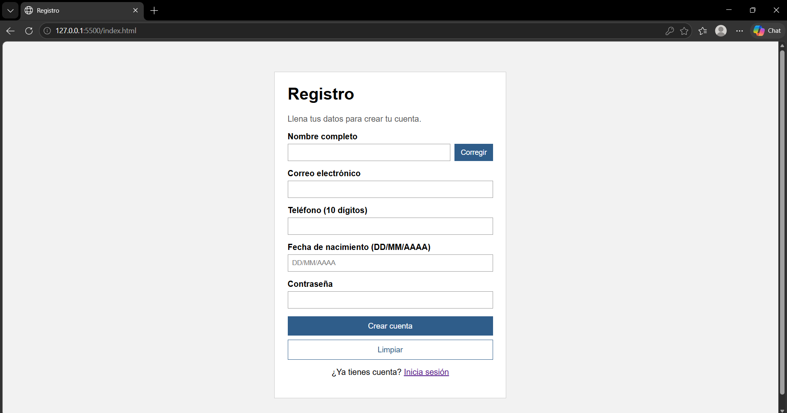
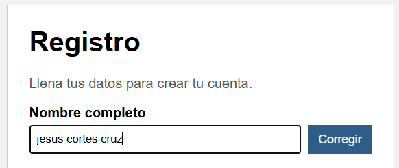
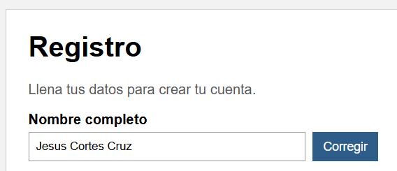
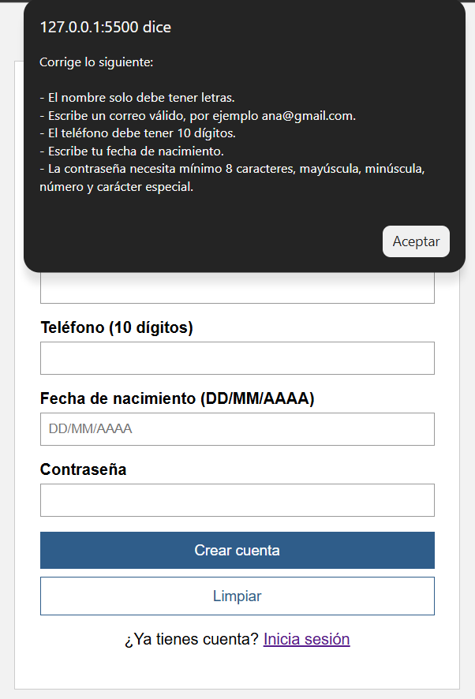
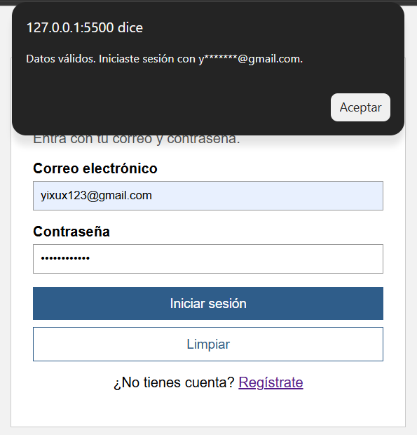
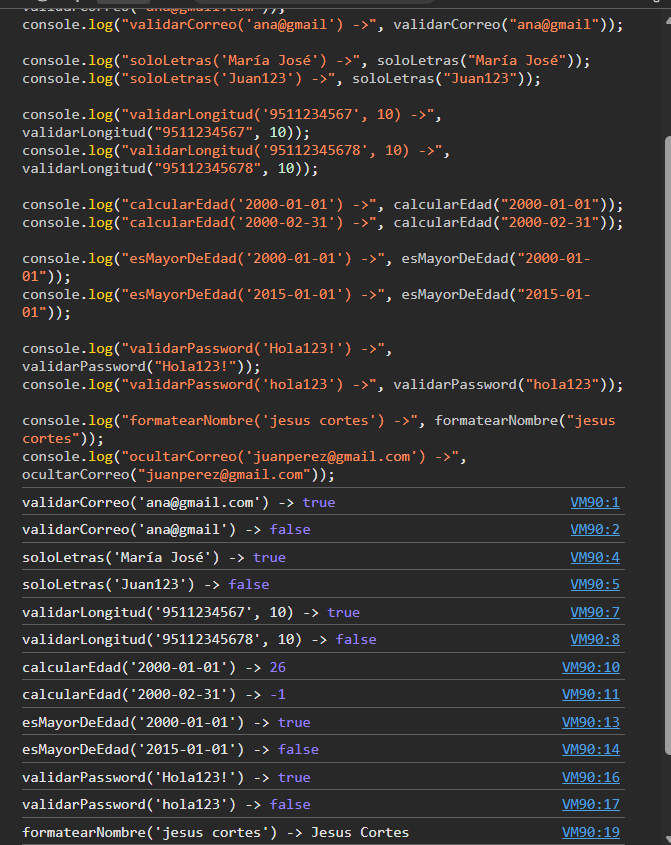

# Utilería JS

Librería de validaciones escrita en JavaScript puro (sin frameworks ni componentes visuales). Se usa en un formulario de registro con ventana modal (`index.html`) y en una página de inicio de sesión (`login.html`).

## Estructura

```
utileria/
├── css/
│   ├── formulario.css   → Estilos del registro y la modal
│   └── login.css        → Estilos del login
├── img/                 → Capturas de pantalla
├── js/
│   ├── formulario.js    → Lógica del registro y la modal
│   ├── login.js         → Lógica del login
│   └── utileria.js      → La librería
├── index.html           → Formulario de registro
├── login.html           → Inicio de sesión
└── README.md
```

## Cómo funciona

**Registro (`index.html`):** valida nombre, correo, teléfono, fecha de nacimiento y contraseña. Si hay errores, se muestran todos juntos en un alert. Si todo está bien, se abre una ventana modal con la edad calculada. Si la persona es menor de edad, no se permite el registro.

- El botón **Corregir**, junto al nombre, lo acomoda con mayúscula inicial (`jesus cortes` → `Jesus Cortes`). Si ya está bien escrito, no hace nada.
- El botón **Limpiar** borra todos los campos.
- La fecha se escribe solo con números y las diagonales se ponen solas.

**Login (`login.html`):** valida el correo con `validarCorreo` y la contraseña con `validarPassword`. También tiene botón **Limpiar**.

Para probarlo, abre `index.html` en el navegador.

---

## Funciones obligatorias

### `validarCorreo(correo)` → boolean

Revisa que el correo tenga usuario, @, dominio y extensión de mínimo 2 letras, sin espacios.

```js
validarCorreo("ana@gmail.com"); // true
validarCorreo("ana@gmail");     // false
```

### `soloLetras(texto)` → boolean

Revisa que el texto tenga solo letras. Acepta acentos, ñ, ü y un espacio entre palabras.

```js
soloLetras("María José"); // true
soloLetras("Juan123");    // false
```

### `validarLongitud(numero, maxLongitud)` → boolean

Revisa que sean solo dígitos y que no pasen del máximo indicado.

```js
validarLongitud("9511234567", 10); // true
validarLongitud("95a1", 10);       // false
```

### `calcularEdad(fechaNacimiento)` → número entero

Calcula los años cumplidos a partir de una fecha `AAAA-MM-DD`. Regresa -1 si la fecha no existe o es del futuro.

```js
calcularEdad("2000-01-01"); // 26 (en 2026)
calcularEdad("2000-02-31"); // -1
```

### `esMayorDeEdad(fechaNacimiento)` → boolean

Revisa si la persona tiene 18 años o más.

```js
esMayorDeEdad("2000-01-01"); // true
esMayorDeEdad("2015-01-01"); // false
```

### `validarPassword(password)` → boolean

Exige mínimo 8 caracteres, una mayúscula, una minúscula, un número y un carácter especial.

```js
validarPassword("Hola123!"); // true
validarPassword("hola123!"); // false (sin mayúscula)
```

---

## Sección libre

### `formatearNombre(texto)` → texto

**Problema que resuelve:** la gente escribe su nombre desordenado. Quita espacios de más y pone mayúscula inicial en cada palabra. Se usa en el botón **Corregir**.

```js
formatearNombre("jesus cortes");    // "Jesus Cortes"
formatearNombre("  jUAN   pérez "); // "Juan Pérez"
```

### `ocultarCorreo(correo)` → texto

**Problema que resuelve:** mostrar con qué correo se registró o entró el usuario sin exponerlo completo. Deja visible solo la primera letra y el dominio.

```js
ocultarCorreo("juanperez@gmail.com"); // "j********@gmail.com"
```

---
## Capturas de pantalla










### Consola mostrando resultados



### Video promocional

[ Ver video](https://jesuscortes-designer.github.io/actividad-2-utileria/img/video.mp4)